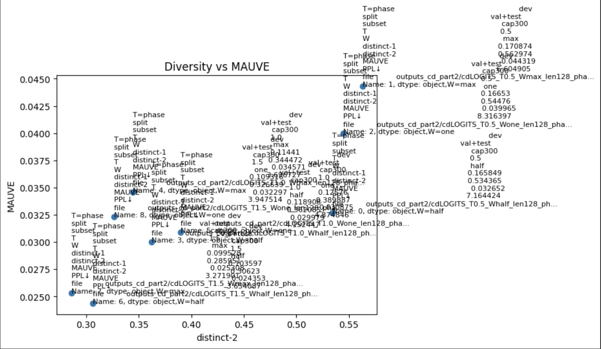

# Contrastive Decoding: Temperature & Context Window Ablations

This project extends from  **Li et al., 2022: _Contrastive Decoding: Open-ended Text Generation as Optimization_**  
PDF: https://arxiv.org/pdf/2210.15097

## Contrastive Decoding

**Intuition:** A strong LM (expert) is generally more reliable than a small LM (amateur). Failure modes that show up in the expert are usually more frequent in the amateur. We can use that difference to guide decoding: prefer tokens the expert likes and the amateur does not.

**Step 1: Plausibility mask.** Compute expert next-token log-probs and mask out tokens that are implausible for the expert. Only keep tokens that pass an adaptive threshold relative to the expert’s own maximum at this step:

$$
\mathcal{F}_t=\{\,w \mid P_E(w \mid x_{<t}) \ge \alpha \cdot \max_{u} P_E(u \mid x_{<t}) \,\}.
$$

**Step 2: Contrastive score.** Among the expert-plausible candidates $\mathcal{F}_t$, score each token by:

$$
\mathcal{s}_t = log P_E (w | x_{<t}) - \beta log p_A (w | x_{<t}) = log (\frac{P_E(w | x_{<t})}{P_A(w | x_{<t})^\beta})
$$

Tokens the amateur over-prefers (generic/repetitive) get pushed down; tokens relatively favored by the expert get pushed up.

**Why the mask first?** 
- False positives: tiny $P_A$ can blow up the ratio for bad tokens.
- False negatives: good, context-appropriate tokens liked by both models get over-penalized.

The expert-based mask restricts ranking to reasonable candidates at each step, reducing both issues. The mask is adaptive: when the expert is confident (peaky $P_E$), the kept set is small; when uncertain (flat $P_E$), the kept set expands.

**Compared to standard decoding (expert-only):**
- **Greedy**: Greedy decoding picks the single most probable token at each step, so the expert often defaults to safe, frequent fillers; once a bland token is chosen, exposure bias can snowball into repetition loops.
- **Beam**: Beam search keeps the top $K$ partial sequences but still optimizes the same single-model likelihood, which means high-frequency, bland continuations can still dominate—and it is more computationally expensive.
- **Nucleus (top-p)**: Top-p sampling improves diversity by sampling from a probability nucleus, but it does not change the model’s preferences; generic or slightly off-topic tokens inside the nucleus can still be selected.
- **Contrastive Decoding**: CD changes the scoring signal itself by penalizing tokens the amateur over-prefers and favoring tokens the expert prefers more than the amateur, which reduces filler, repetition loops, and off-topic drift while promoting context-aware choices.


We implement CD with an **expert** and **amateur** from the same family (e.g., `gpt2-large` vs `gpt2`) and run a small ablation on **WikiText-103**:

### Ablation grid (9 configs)

- Amateur **temperature**: `T ∈ {0.5, 1.0, 1.5}`
- Amateur **context window**: `W ∈ {one, half, max}`
  - `one`: last 1 token
  - `half`: `W_half = min(model_ctx, floor(GEN_LEN/2))`
  - `max` : `W_max  = min(model_ctx, GEN_LEN)`

**Metrics (as in Li et al., §5.1)**
- **Diversity**: distinct-1 / distinct-2  
- **MAUVE**: distributional similarity to human text  
- **Coherence**: Perplexity ↓ (computed with the expert LM)


**Outputs**
- Raw generations: `outputs/*.jsonl` 
- Aggregated metrics CSV and plot: `results/` 

---

## Setup

```bash
python3 -m venv .venv && source .venv/bin/activate
pip install -r requirements.txt
```

Run:
Quick sanity run (CPU ok):
```bash
python run.py --teacher gpt2 --student gpt2 --phase dev --dev-cap 30 \
  --temps 0.5 1.0 --windows one max --gen-len 64 --beta 0.5 --alpha 0.1 --beam 1

python eval.py --phase dev --split "val+test" --subset-tag cap30 --results-dir results
```

Full dev run (GPU L4 recommended):
```bash
python run.py --teacher gpt2-large --student gpt2 --phase dev --dev-cap 300 \
  --temps 0.5 1.0 1.5 --windows one half max --gen-len 128 --beta 0.5 --alpha 0.1 --beam 1

python eval.py --phase dev --split "val+test" --subset-tag cap300 --results-dir results
```

This writes:
- results/ablation_metrics_phase-...csv
- results/diversity_vs_mauve.png

## Results & analysis
<p align="center">
 
 </p>

<p align="center">
Scatter: Diversity vs MAUVE (each point is a (T, W) config)
 </p>

**Best by metric:**  
Diversity (Distinct-2) was 0.5630 at $T = 0.5$, $W = max$.  
MAUVE was 0.0443 at $T = 0.5$, $W = max$.  
Coherence (PPL, lower is better) was 3.27 at $T = 1.5$, $W = max$.

**Interpretation:**  A lower amateur temperature ($T=0.5$) sharpens the amateur’s distribution, which strengthens the contrastive penalty on generic tokens. This produces higher distinct-n and higher MAUVE, but it also raises perplexity. Increasing the amateur temperature weakens the penalty, so the expert settles on safer, higher-probability tokens; perplexity goes down but diversity and MAUVE decline. Larger amateur windows usually help because, with more context, the amateur flags repetition loops and generic continuations more reliably.

**Trade-offs:** 
Cooling the amateur improves diversity but can harm next-token likelihood. 
- At $T = 1.0$, increasing the window size improves MAUVE and perplexity but can slightly reduce distinct-2.
- At $T = 1.5$, using the maximum window helps perplexity the most, while diversity tends to drop.

**Qualitative examples:**  

Prompt: “Headlam served as Officer Commanding North-Western Area in 1946… during the Malayan Emergency …”  
Best ($T = 0.5$, $W = max$): the continuation introduces concrete entities and a clear timeline, for example references to P-40s, the Royal Flying Corps, and multiple RFC squadrons.  
Worst ($T = 1.5$, $W = max$): the continuation collapses into a repetitive loop, repeating clauses such as “he was appointed…” with minimal lexical variety.

Prompt: “After completing a conversion course, Headlam was assigned to the Seaplane Squadron at Point Cook…”  
Best ($T = 0.5$, $W = max$): the text progresses coherently, connecting events with sensible transitions, such as squadron activity through 1943, orders to Australia, marriage, a D-Day recall, and a posting to an RAF station.  
Worst ($T = 1.5$, $W = max$): the text becomes redundant, repeating the same clause about a radar station without adding new information.

Prompt: “Headlam completed a flying instructors course in July 1936 and joined the staff of No. 1 FTS…”  
Best ($T = 0.5$, $W = max$): the continuation stays on topic with plausible training and operations details, postings, and a consistent timeline.  
Worst ($T = 1.5$, $W = max$): the continuation drifts into off-topic and sensational claims, producing content that reads less grounded in the given context.


